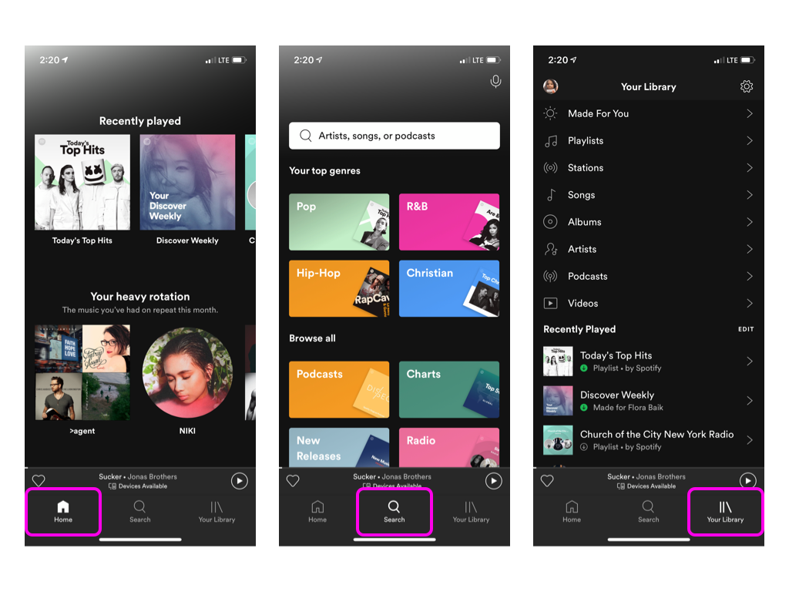

# Spotify - user experience
## By Jonathan Macoco
### Febuary 24, 2022
[Home](../)
 
  I personally use Spotify most of the time when I play music. I would say that it is a fairly good design with some minor issues. When you first log in you have three main options at the bottom plus the latest song that you have just listened to. 
  
   This toolbar is minimalist yet **efficient** as the user isn’t overloaded with the tools at hands such as home, search, and your library. Although as for the rest of the screen it is a fairly decent design I would say that it does have a lot of <b>noise</b>. I would say that this is especially bad on the home page and search page as there are so many buttons to click which can lead to users clicking on the wrong button. I would say that they could use a few fewer buttons to help with this issue. This can be very annoying for people who use this on the go as it results in them having to correct an error. Another point that I would like to add is error tolerance. 
  
When making a mistake on Spotify such as skipping a song or clicking the wrong song is decent as users can swipe left(or “swipe back”) on the song allowing them to correct their mistakes. Making the app very <b>effective</b> at playing songs that the user desires. This in turn can make playing music with Spotify much more enjoyable as there it allows them to play access any song they would like. 

 
 Spotify does a great job with <b>accessibility</b> as anyone can use it without a cost. This is one of Spotify’s best features as one of its biggest competitors apple music doesn’t offer a free version so you have to pay a subscription. So Spotify is very <b>effective</b> at allowing users to play music whenever they want. One other big aspect of Spotify is customization as it can be personalized to users' taste in music. This aspect of customization draws people into the app as they can find new music suited to their taste. One big part of this would be “Spotify Wrapped” which is a feature that shows the user their top artist or songs that they listened to that year. This is can allow the app to be more sociable as people can show others their top artist giving them a topic for discussion. 

 
 Spotify is a great platform for people to listen and stream their music as it is very <b>accessible</b> and <b>effective</b> in playing what the user wants. The screen is quite <b>Noisy</b> and can overwhelm the user with unnecessary information. Something that could be used to combat this problem would be to take away some buttons leaving the user with an easier time navigating. 

[Home](../)
