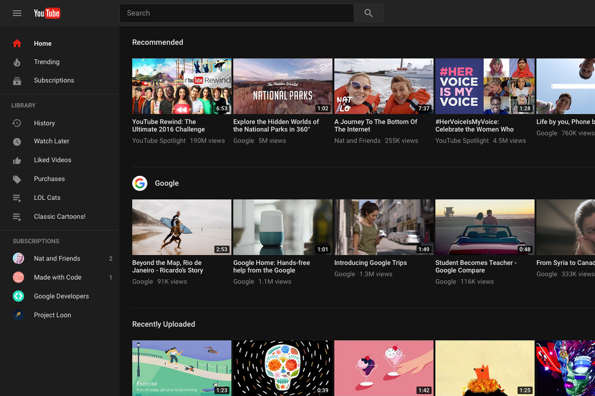

# Youtube - user experience
## By Jonathan Macoco
### April 14, 2022
[Home](../)

  I have been using Youtube as a source for not just entertainment but also to help me learn new things such as code. I have also been using youtube for quite some time and I can say that the user experience has gotten better. As a user, my main goal is to watch videos and youtube does a very **efficient** job of doing so. An example of this can be seen when you first open youtube, you are displayed with lots of videos that are related to your history. This is great for people who are bored and unsure of what to watch as it allows them to choose a video of their interest right when they log on. So youtube wastes no time in getting you to watch videos. The Youtube search bar is right at the top middle section of the home page. This allows users easy access to search for specific videos as well as displaying videos by relevance to your search. Users also can also filter their search such as by rating. So this is another example of how **efficient** youtube is at showing users videos they would like to watch. One other great thing about youtube's user experience is that it has a good **error tolerance**. 
  
  If a user clicks on the wrong video they can easily swipe or click back to the previous page or video.	Users can also unlike and unsubscribe from users’ videos, this allows for users to have a more customized experience as well. As they will get videos that are related to who they’re subscribed to and previous videos they’ve liked. Youtube also has some pretty good **Safety** features.
  
  **Safety** and Privacy for youtube can be a bit troublesome as most users’ feed is based on who they’re subscribed to, liked videos, etc. What youtube does offer in terms of privacy can be seen within the settings tab. Here users can hide who they’re subscribed to and hide playlists from other users. Youtube does have a pretty good **safety* for kids as in the settings tab parents can set up youtube for kids. This is a separate application but it’s pretty much the same as youtube. Youtube kids allow parents to block and share content with their kids. This a great for parents as it allows them to monitor their children on what they can watch. 
  
  Overall I think that youtube has a great user experience. I think that youtube is one of the most **efficient* applications that allows users to watch videos for entertainment or as a learning source. Youtube also has a great **error tolerance** along with fairly good **safety**. I personally use youtube quite often and would say it’s a great application with a good user experience. 

  
[Home](../)
